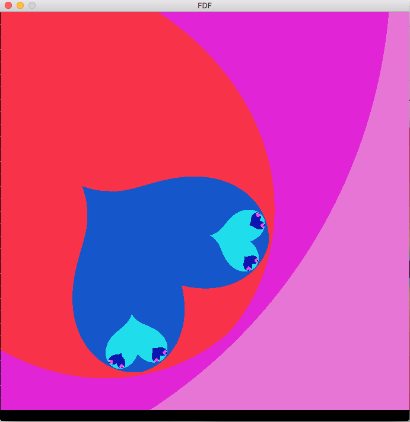
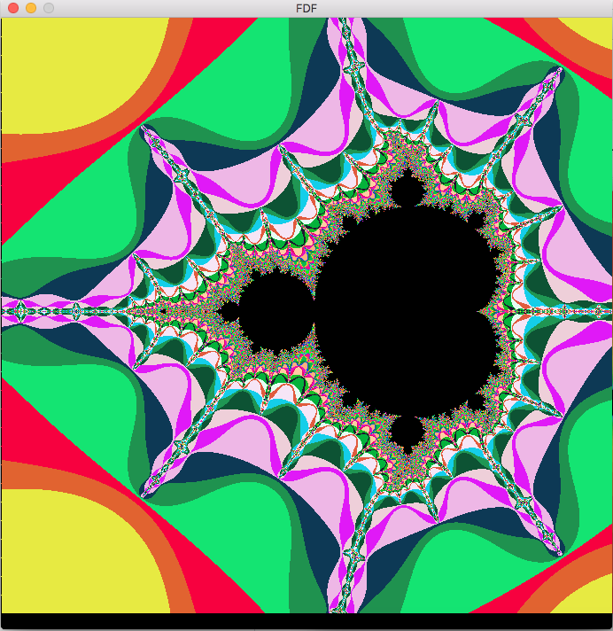
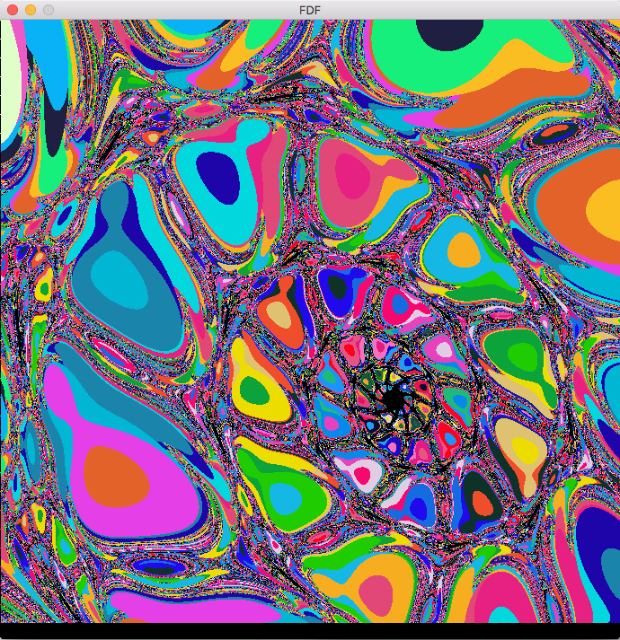
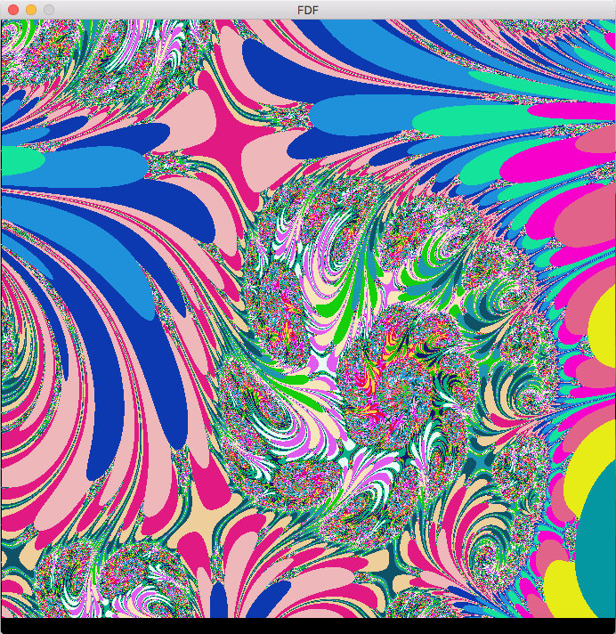
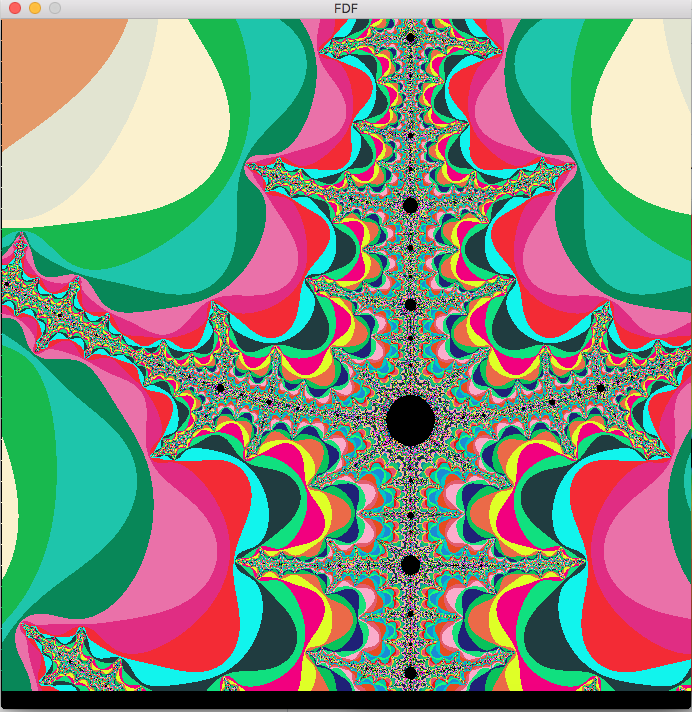
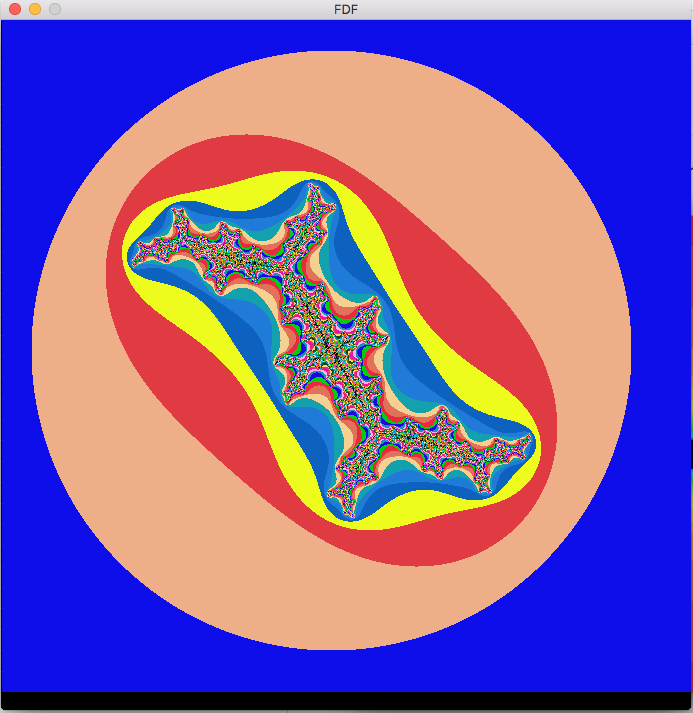

# fract_ol
fract_ol consiste a creer des magnifiques fractals  
MANUEL:  
change color:			r g b  
move:  					  	up down left right  
change fractal:				   		c  
initialisation:								space  
zoom in/out:										mouse left/right  
change size of fractal:									  +/-  

